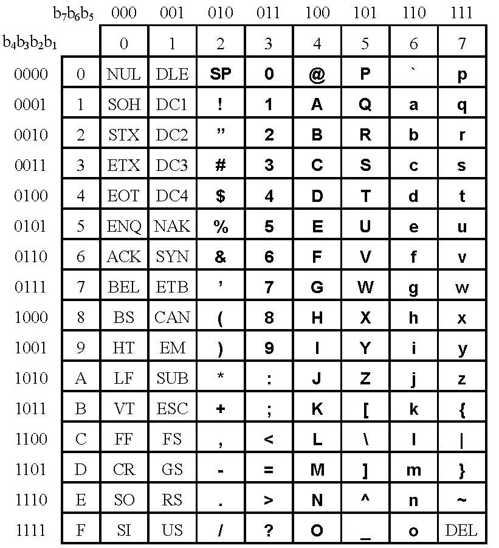
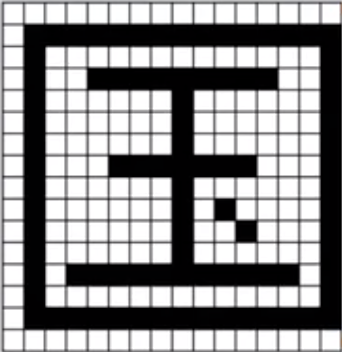

字符编码
******

ASCII码
=======

|	ASCII的全称是American Standard Code for Information Interchange, 美国信息互换标准代码。ASCII码是一套基于拉丁字母的字符编码，也是世界最通用的字符编码之一。

|	ASCII码采用高三位和第四位，总共7位进行编码，共编码了128个字符。其中包括33个控制字符，和95个可显示字符。

|   ASCII码在计算机中用1个字节进行存储。

.. note::

    字符可以比较大小：

    * 数字 < 大写字母 < 小写字母
    * 小写字母比对应的大写字母的ASCII值大32

汉字编码
=======

内码（机内码）
++++++++++

- 在计算机内部用来进行汉字存储、处理的二进制编码
- 存储一个汉字至少占用2个字节
- 一字一码

输入码（输入法）
++++++++++++

- 方便汉字的输入
- 一字多码

字形码
+++++

- 负责显示、打印输出汉字

.. code-block:: text

   问题1：已知A的ASCII码值为65，则b的ASCII码值是多少？

   答案：字符a的ASCII码值是65+32=97，所以字符b的ASCII码值是98.

.. code-block:: text

   问题2：对字符'a', 'B', 'z', '6'进行升序排列，排列结果是？

   答案：'6', 'B', 'a', 'z' 

.. code-block:: text

   问题3：在"today.txt"文件中输入以下内容并保存，其中字符‘0’在计算机中的存储形式是：

   A. 00110000
   B. 110000
   C. 0000000
   D. 0

   答案：A（字符在计算机中用1个字节存储）

.. image:: ascii_0.png
   :scale: 50%

.. code-block:: text

   问题4：如图所示，汉字“国”的字形码用16x16的黑白点阵表示，请问在计算机中需要多少字节进行存储？
   
   答案：由于用黑白点阵，所以每个点只需要1位二进制来编码。16x16的点阵共需要16x16x1 = 256位进行编码，故所需256/8 = 32字节存储。

