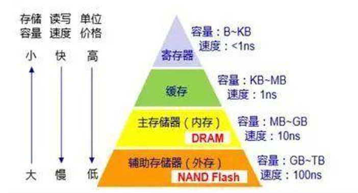

计算机配置
========

中央处理器（CPU)
--------------

CPU是计算机的“大脑”，包括运算器和控制器。衡量CPU性能的主要指标有：

* 主频
* 字长
* 高速缓存

存储器
-----

存储器用来存放指令或者数据，分为内存储器（简称内存）和外存储器（简称外存）。

内存
""""
内存包括只读存储器（ROM）和随机存取存储器（RAM)两类。两者区别如下：

.. list-table:: 
   :widths: 25 50 50
   :header-rows: 0

   * - 内存
     - RAM
     - ROM
   * - 全称
     - Random-access memory
     - Read-only memory
   * - 数据读写
     - 可读可写
     - 只能读不能写
   * - 数据易失性
     - 掉电后数据全部丢失
     - 掉电后数据不会丢失
   * - 用途
     - 存储计算机所有正在运行的程序和数据
     - 存储系统引导程序、开机启动程序和系统初始化程序等信息

.. note::

    * CPU所有运行的指令和数据都存放在内存中
    * 内存性能的指标：内存主频、存储容量。

外存
""""
距离：U盘、硬盘、光盘等

存储介质区别
""""""""""
* 寄存器、缓存、内存和外存都是计算机内部的存储器，区别在于寄存器和缓存是CPU的内部部件，而内存与外存是独立的存储介质。如果想要了解更多关于计算机存储结构的内容，可以参考这篇文章：`请问CPU,内核、寄存器、缓存、内存、外存的区别 <https://www.zhihu.com/question/24565362>`_

.. note::

    总结：

    * 存储容量从小到大：寄存器，缓存，内存，外存（最大）
    * 读写速度从小到大：外存，内存，缓存，寄存器（最快）
    * 单位价格从小到大：外存，内存，缓存，寄存器（最贵）

