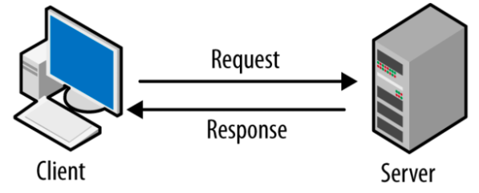
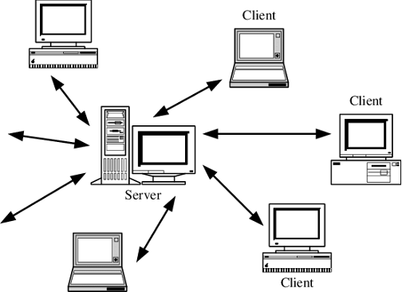
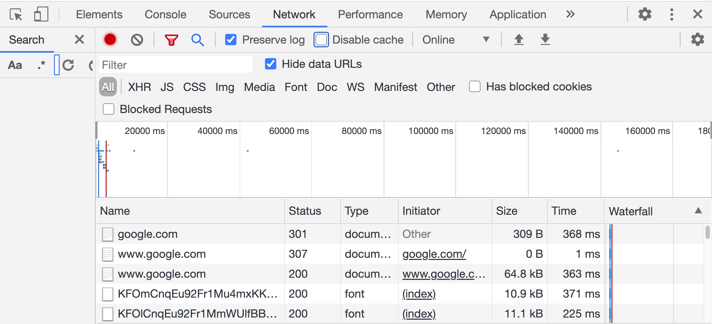
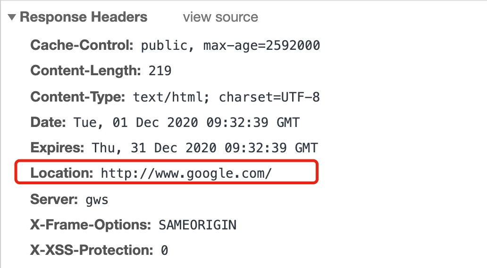
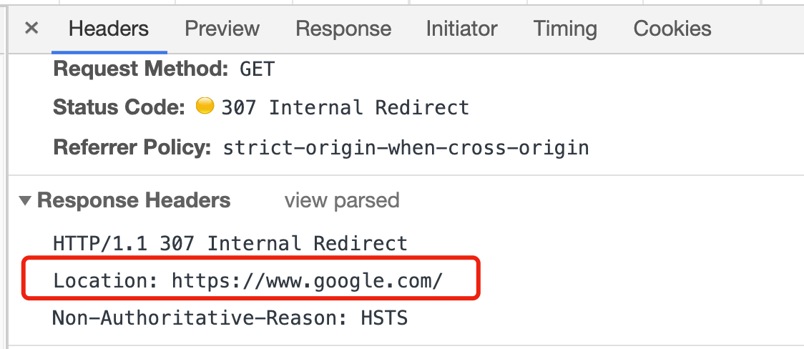

网络协议(上)
====

终端
----
* 终端和我们日常用的浏览器一样，本质也是一段程序。只不过这个程序可以对电脑做更多的事情。

* 终端的界面对于某一类人群非常友好，比如工程师、科研工作者等。但对于我们普通用户来说，我们更习惯于用浏览器浏览网页。

* 浏览器的本质也是一段程序。网络通信实际上是程序和程序之间的通信。

客户机-服务器模型
--------------
* Google.com本质也是一段程序，这段程序在google的服务器上运行。

* 访问google.com时，浏览器作为一个客户机（Client）向google的服务器发出一个请求。Google服务器（Server）响应请求并将搜索的结果返回给客户机。

* 可以类比我们平常去餐馆吃饭。我们点菜的时候，是作为客户在消费。我们作为消费者，角色相当于客户机，餐馆则作为服务器提供服务。一个餐馆同一时段可能要服务很多客户。同样，一台服务器同时也会处理很多客户机的请求。

* 客户机-服务器模型是现代互联网的基本架构。客户机之间交流需要通过服务器进行。现代互联网是以服务器为中心来运行的。

去中心化浪潮
----------

* 我们每天都在使用互联网公司提供的服务，比如通过微信服务器聊天，通过钉钉服务器上网课，通过淘宝和京东服务器网购。

* 中心化的服务器为我们的生活提供了很多便利，但也带来了很多问题，包括隐私、安全、成本昂贵、垄断等等。

* 现在科技界兴起一波“去中心化”的浪潮，目的是打破大公司的服务器在互联网中的垄断地位。

* 典型去中心化技术包括P2P和Blockchain。

WWW
---

* www是world wide web的缩写，中文又称做万维网。在互联网刚刚兴起时网站很少，为了区别于其它网络服务（如邮箱服务），很多网站习惯在域名前面加上www。

* www.qq.com是qq.com的子域名。qq.com的其它子域名还包括mail.qq.com（qq邮箱）、live.qq.com（企鹅直播）、auto.qq.com（腾讯汽车）......

HTTP
----
* HTTP：Hyper Text Transport Protocol，超文本传输协议。HTTP是一整套客户机和服务器之间的通信规范。现实生活里，我们第一次见面，一个人会先自我介绍：“你好，我叫胡桐”，然后伸出右手。此时对方也会开始自我介绍，并且伸出他们的右手握住我的右手。

* 我们访问google.com，可以类比浏览器向google服务器发了一封信。信的前两行是：

.. code-block:: text

    GET /  HTTP/1.1
    HOST:  www.google.com

* GET表示浏览器希望从google服务器获取信息，HTTP/1.1表示浏览器访问google使用的是HTTP协议的1.1版本。HOST一行代表浏览器希望访问的服务器域名。

* google服务器回复了一封非常长的信，信的前两行是：

.. code-block:: text

    HTTP/1.1      200 OK
    Content-Type: text/html

* 信的前几行（不管是寄信还是收信）称作HTTP header。它里面包含了寄信人和收信人的一些基本信息。日常生活中，我们寄快递需要填一个单子，收信人和寄信人是谁，里面是什么类型的物品，大概有多重，需要怎么运输，是陆运还是空运……

* 200是HTTP的状态码，表示浏览器的请求进行顺利。

.. note::

    HTTP的状态码还有很多，一些常用的状态码列举如下：

    * 200:  OK

    * 301:  Moved Permanently

    * 302:  Found

    * 307:  Temporary Redirect

    * 401:  Unauthorized

    * 403:  Forbidden

    * 404:  Not Found

    * 500:  Internal Server Error

* 301、302、307的含义是类似的，都意味域名资源已经改变了位置。服务器通常会发送HTTP Location来重新定向到新的位置。

* 在Chrome浏览器中我们可以记录并观察每一条网络请求的相关信息。进入chrome之后，鼠标右键->inspect->Network，然后点击Preserve Log（记录所有网络请求）。

* 在浏览器地址栏中输入google.com，你会看到工具栏中出现了很多请求。其中第一个请求状态码是301，表示google.com对应的域名资源已经改变了位置，新的域名在Response Headers中的Location里面。

* 浏览器又向新的域名发了一次请求。第二个请求的状态码是307。意味着第一个请求返回的新的域名资源依然不存在，服务器又返回一个新的地址。

* 浏览器又向新的域名发了一次请求。第三个请求的状态码是200。意味着新的域名资源是存在的，并且返回相应的网页。

