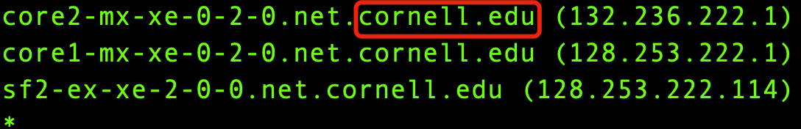

计算机网络作业一
=============

完成以下作业： :download:`计算机网络作业 <hw-network1.docx>`.

* 截止时间：12月3日晚上八点前（A班），12月6日晚上八点前（B班）

* 提交方式：发送邮件至tong.hu@scls-sh.org

附加题 (迟交作业的同学要做，不做算漏一题)：

找到从你的电脑到康奈尔大学的服务器(cornell.edu)经过的路由器路径，并且：

1. 顶级路由器喜欢将当地城市的机场代号放入自己的域名中。观察路径上的路由器域名，将路径上所有的城市列举在本题下方。

（比如上海 -> 香港 -> 东京 -> ......)

2. 放上路径屏幕截图。

注意：路由器域名后缀为cornell.edu即表示已到达学校服务器，此时可以按下ctrl+C终止命令。

